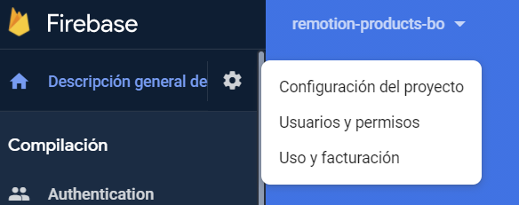
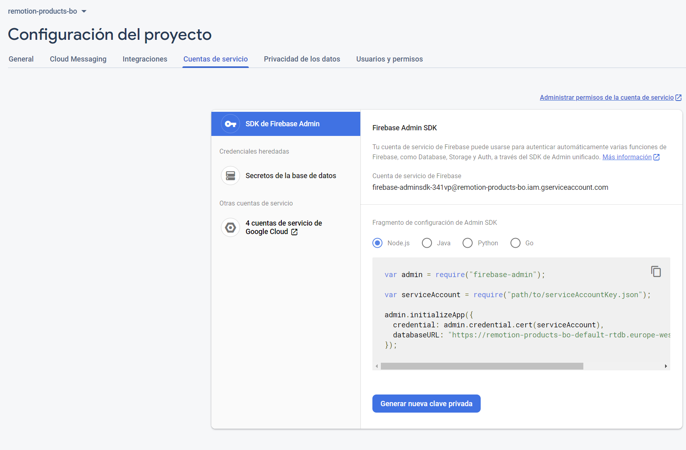

# Remotion App (remotion-quasar)

Remotion back office is based on [Quasar](https://next.quasar.dev/) components library,
which is a wrapper for Vue. See docs for better understanding.

This app runs on a Firebase hosting container and has configurations enabled for
realtime database, authentication, remote config and storage

## Install the dependencies
```bash
yarn
```

### Build the app for production (SPA)
```bash
yarn build
```

### Customize the configuration
See [Configuring quasar.conf.js](https://v2.quasar.dev/quasar-cli/quasar-conf-js).

### Firebase
Firebase project configuration is set as env variable at quasar.config.js.
#### Deploy
```bash
yarn deploy
```
#### Local development
To use app y local environment without affecting production project just start the
emulators and set NODE_ENV=dev. yarn dev will automatically set env to dev.
With emulators running, just access to ui and create a user to login at remotion back office.
```bash
yarn emulators
```
```bash
yarn dev
```

#### User Creation (Production)
service-account.json is needed for the cli to access admin sdk credentials. At firebase console
go to project configuration



Go to service account tab and generate a new private key. Save this file as "service-account.json"
at the root of the project (don't commit this file as it contains credentials)



Once this is ready, to create a user for production use
```bash
yarn create-user
```
and follow prompts.

Role assignment is not ready yet
